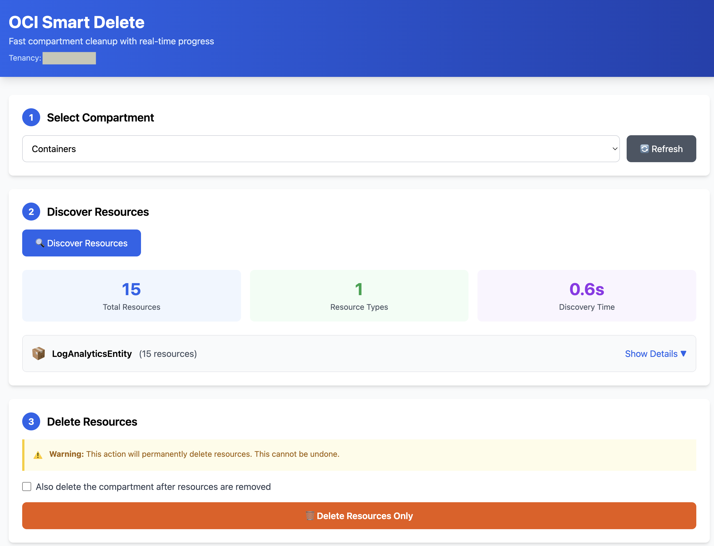

# OCI Smart Delete - Fast Compartment Cleanup Tool

A blazing-fast OCI compartment cleanup tool with a beautiful web interface. Delete hundreds of resources in seconds using search-first discovery.

## 🌐 Web Interface (Recommended)

The easiest way to use OCI Smart Delete is through the **web interface**:

### Quick Start

```bash
# Clone the repository
git clone https://github.com/timmcfadden/OCI-SmartDelete.git
cd OCI-SmartDelete

# Mac/Linux - Run setup script
./setup.sh

# Windows - Run setup script
setup.bat

# Open http://localhost:8080
```

**Features:**
- 🎨 Beautiful, modern UI with real-time updates
- 🔍 Visual compartment browser and resource discovery
- 📊 Progress tracking and detailed results
- ✅ Safe deletion with confirmations
- 🔒 Uses your existing OCI CLI credentials

The setup script will automatically:
- Check Python installation
- Create a Python virtual environment (keeps dependencies isolated)
- Install required dependencies
- Verify OCI credentials
- Start the web server

### Web Interface Screenshot



---

## 💻 Command Line Interface

For automation, scripting, or CLI preference:

### Quick Start

```bash
# Basic usage
python3 oci_smart_delete.py -c <compartment_ocid>

# Force delete without confirmation
python3 oci_smart_delete.py -c <compartment_ocid> -force

# Use specific config profile
python3 oci_smart_delete.py -c <compartment_ocid> -cp PRODUCTION

# Debug mode
python3 oci_smart_delete.py -c <compartment_ocid> -debug
```

### Command Line Options

```
usage: oci_smart_delete.py [-h] -c COMPARTMENT [-cp CONFIG_PROFILE]
                           [-cf CONFIG_FILE] [-force] [-rg REGIONS] [-debug]

required arguments:
  -c, --compartment      Compartment OCID to delete

optional arguments:
  -cp, --config-profile  Config profile (default: DEFAULT)
  -cf, --config-file     Config file path (default: ~/.oci/config)
  -force                 Force deletion without confirmation
  -rg, --regions         Comma-separated regions (default: all subscribed)
  -debug                 Enable debug logging
```

---

## Why OCI Smart Delete is Better

### Speed Comparison
```
Traditional Tools:  3-5 minutes (scanning 60+ empty resource types)
OCI Smart Delete:   1-2 seconds (only processes what exists)
```

### Key Advantages

1. **Search-First Discovery** 🔍
   - Uses OCI Search service to find what actually exists
   - Only processes resource types found in the compartment
   - **100x faster** than traditional iteration approaches

2. **Comprehensive Coverage** 📋
   - Supports **124 resource types** across all OCI services
   - Auto-generated from OCI SDK introspection
   - Easy to extend with new resource types

3. **Smart Dependency Handling** 🧠
   - Automatically deletes resources in the correct order
   - Retries failed deletions (handles temporary state conflicts)
   - Exponential backoff for rate limiting

4. **Better Error Handling** ✅
   - Clear logging and progress indicators
   - Recognizes already-deleted resources
   - Detailed summary with success/failure breakdown

---

## How It Works

### 1. Discovery Phase (1-2 seconds)
```python
# Uses OCI Search service
query = """
  query all resources where
    compartmentId = '{compartment_id}' &&
    lifecycleState != 'TERMINATED'
"""
```

### 2. Smart Deletion
- Groups resources by type
- Determines dependency order
- Parallel processing within each type
- Auto-retry with exponential backoff

### 3. Results
```
================================================================================
Deletion Summary (completed in 45.2 seconds)
================================================================================
Successfully deleted: 127 resources
Failed to delete: 2 resources

Failed resource types:
  - GenAI Agent: 2 (dependency conflicts)
```

---

## Supported Resource Types (124)

### Compute (10)
- Instance, Image, BootVolume, Volume
- InstanceConfiguration, InstancePool, ClusterNetwork
- AutoScalingConfiguration, DedicatedVmHost, ConsoleHistory

### Networking (26)
- VCN, Subnet, InternetGateway, NatGateway, ServiceGateway
- RouteTable, SecurityList, DHCPOptions
- Drg, DrgAttachment, LocalPeeringGateway, RemotePeeringConnection
- LoadBalancer, NetworkLoadBalancer
- PublicIp, PrivateIp, NetworkSecurityGroup
- And more...

### Database (17)
- DbSystem, AutonomousDatabase, AutonomousContainerDatabase
- MySQL (DbSystem, Backup, Channel)
- PostgreSQL (DbSystem, Backup)
- NoSQL Table, and more...

### Storage (10)
- Bucket, Volume, BootVolume, VolumeBackup, BootVolumeBackup
- FileSystem, MountTarget, Export, Replication

### Container & Kubernetes (4)
- Cluster, NodePool, ContainerInstance

### Functions & API Gateway (6)
- Function, Application
- ApiGateway, ApiDeployment, Api

### Monitoring & Logging (8)
- Alarm, LogGroup, Log
- LogAnalyticsEntity, LogAnalyticsLogGroup
- ServiceConnector

### Cloud Native (10)
- Stream, StreamPool, ConnectHarness
- Notifications (OnsTopic, OnsSubscription)
- Events

### Security (10)
- Vault, Key
- Bastion
- CloudGuard (Target, DetectorRecipe, ResponderRecipe, ManagedList)
- Certificate, CertificateAuthority

### Data Services (11)
- DataScienceProject, Model, NotebookSession, ModelDeployment
- DataCatalog, DisWorkspace
- AnalyticsInstance, IntegrationInstance
- VisualBuilder, GoldenGate

### IAM (7)
- User, Group, DynamicResourceGroup, Policy
- Compartment, IdentityProvider, NetworkSource

### DNS (6)
- CustomerDnsZone, DnsResolver, DnsView
- SteeringPolicy, SteeringPolicyAttachment, TsigKey

### DevOps (8)
- DevopsProject, Repository, BuildPipeline, DeployPipeline
- ResourceManager Stack, ConfigurationSourceProvider

### Misc Services
- OpenSearch, Redis, NoSQL
- And many more...

---

## Requirements

- Python 3.7+
- OCI Python SDK (`oci`)
- Flask (for web interface)
- Valid OCI credentials (CLI config file or environment variables)

**Install dependencies (recommended with virtual environment):**
```bash
# Create and activate virtual environment
python3 -m venv venv
source venv/bin/activate  # On Windows: venv\Scripts\activate

# Install dependencies
pip install -r requirements.txt
```

---

## Troubleshooting

### "No deletion config for X"
The resource type isn't in the mappings. Add it manually or regenerate mappings.

### "Dependency conflict"
Resource has dependencies. The tool will automatically retry. If it persists after 3 attempts, you may need to manually delete dependencies first.

### "Already deleted (404)"
The resource was deleted between discovery and deletion. This is normal and counted as success.

### "Permission denied"
Ensure your OCI user/policy has delete permissions for all resource types.

---

## Performance Tips

### For Large Compartments (1000+ resources)

1. **Filter by region** if you know resources are concentrated:
   ```bash
   python3 oci_smart_delete.py -c <ocid> -rg us-ashburn-1,us-phoenix-1
   ```

2. **Use parallel deletion** (enabled by default):
   - 10 threads per resource type
   - Multiple resource types in sequence

3. **Monitor progress**:
   ```bash
   python3 oci_smart_delete.py -c <ocid> -force 2>&1 | tee deletion.log
   ```

---

## Safety Features

1. **Confirmation Required**: Unless `-force` is used
2. **Skip System Resources**: Won't delete protected/system resources
3. **Respects Lifecycle States**: Skips DELETED, DELETING, TERMINATED
4. **Detailed Logging**: All actions logged with timestamps
5. **Error Recovery**: Retries with exponential backoff

---

## Extending with New Resource Types

**Note:** The `oci_resource_types.py` file is already included with 124+ resource types. These utilities are only needed if you want to add support for new OCI services.

### Developer Tools

```bash
# Automatically discover new resource types from OCI SDK
python3 generate_resource_types.py -o new_mappings.py

# Or use the comprehensive generator
python3 generate_comprehensive_mappings.py
```

### Manual Addition

Edit `oci_resource_types.py`:

```python
RESOURCE_TYPE_MAP = {
    'YourNewResourceType': {
        'client': 'service_name.ClientName',
        'method': 'delete_resource',
        'id_field': 'id',  # or 'name' for some resources
        # Optional: for wait operations
        'composite': 'service_name.ClientNameCompositeOperations',
        'composite_method': 'delete_resource_and_wait_for_state',
        'wait_states': ['DELETED', 'TERMINATED'],
        # Optional: for dependency ordering
        'dependencies': ['DependentResource1', 'DependentResource2'],
        # Optional: for special handling
        'special': 'custom_handler_name',
    },
}
```

---

## Architecture Comparison

### Traditional Tools (OCI-SuperDelete, ociextirpater)
```
1. Load compartment list
2. For each region:
   3. For each resource type (60+):
      4. List all resources in compartment
      5. Delete found resources

Total time: 3-5 minutes even if compartment is empty
```

### OCI Smart Delete
```
1. Search service: Find all resources (1 second)
2. Group by type
3. Delete in dependency order (parallel within type)

Total time: 1-2 seconds + deletion time
```

---

## Comparison Matrix

| Feature | OCI-SuperDelete | ociextirpater | OCI Smart Delete |
|---------|----------------|---------------|------------------|
| Discovery Speed | 3-5 min | 2-4 min | 1-2 sec |
| Resource Types | 60+ | 66 | 124 |
| Web Interface | ❌ | ❌ | ✅ |
| Search-First | ❌ | ❌ | ✅ |
| Auto Dependency | ❌ | ❌ | ✅ |
| Auto Retry | ❌ | ❌ | ✅ |
| Parallel Delete | ✅ | ✅ | ✅ |
| Summary Stats | ✅ | ❌ | ✅ |

---

## Contributing

To add new resource types:

1. Run discovery:
   ```bash
   python3 generate_resource_types.py -j types.json
   ```

2. Review `types.json` for unmapped types

3. Add to `oci_resource_types.py`

4. Test with a test compartment

5. Submit PR!

---

## License

Universal Permissive License (UPL), Version 1.0

See [LICENSE](LICENSE) for details.

---

## Acknowledgments

This project was inspired by and builds upon the excellent work of:

- **[OCI-SuperDelete](https://github.com/AnykeyNL/oci-superdelete)** by Richard Garsthagen ([@AnykeyNL](https://github.com/AnykeyNL))
  - Original compartment cleanup tool for OCI
  - Pioneered automated resource deletion workflows

- **[ociextirpater](https://github.com/therealcmj/ociextirpater)** by [@therealcmj](https://github.com/therealcmj)
  - Comprehensive OCI resource cleanup solution
  - Advanced resource type coverage

OCI Smart Delete reimagines compartment cleanup with:
- Search-first discovery (100x faster than traditional iteration)
- Modern web interface with real-time updates
- Extended support for 124 resource types
- Intelligent dependency handling and auto-retry logic

Thank you to the OCI community for building the foundation that made this tool possible!
